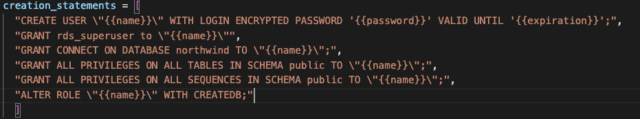
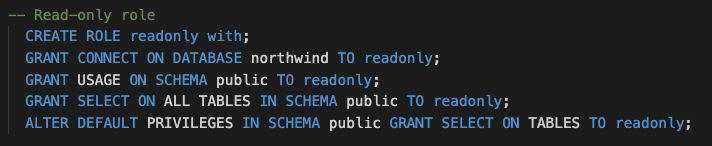
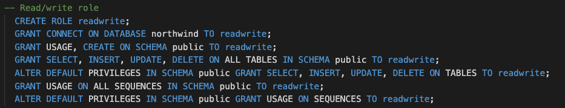

# Securing DB Access MGMT with HashiCorp Boundary

## 1. Building Vault and Boundary clusters in HCP and RDS instance

The **Plataform** directory contains:

* The code to build a Vault and Boundary cluster in HCP together with a VPC in your AWS account.
* That VPC gets connected to HCP (where Vault is deployed) by means of a VPC peering with an HVN.
* The VPC contains a Public and Private Subnet. In the private subnet we are deploying an RDS instance with a PostgreSQL engine (the database will be configured in a second steps)
* After deploying the infrastructure we set a number of environmental variables that are required for the upcoming deployments.
* Finally, we authenticate with Boundary using the credentials we have defined within the `terraform.tfvars` file. Vault cluster is configured to send logs to Datadog.

```bash
<export AWS Creds>
cd 1_Plataform/
# Initialize TF
terraform init
# Requires interactive login to HCP to approve cluster creation
terraform apply -auto-approve
export BOUNDARY_ADDR=$(terraform output -json | jq -r .boundary_public_url.value)
export VAULT_ADDR=$(terraform output -raw vault_public_url)
export VAULT_NAMESPACE=admin
export VAULT_TOKEN=$(terraform output -raw vault_token)
# Log to boundary interactively using password Auth with admin user
boundary authenticate
export TF_VAR_authmethod=$(boundary auth-methods list -format json | jq -r '.items[0].id')
```

> Note: This tutorial is supposed to be run in secuntial order making sure the enviromental variable installed above are used

### 1.1. Inputs

| Variable            | Type   | Example                          | Description                                      | Required                                                                                                                                                       |
| ------------------- | ------ | -------------------------------- | ------------------------------------------------ | -------------------------------------------------------------------------------------------------------------------------------------------------------------- |
| username            | String | "admin"                          | Boundary initial administrative account username | Yes                                                                                                                                                            |
| password            | String | "N0tS0Secr3tPas$w0rd"            | Boundary initial administrative account password | Yes                                                                                                                                                            |
| vault_tier          | String | "plus_small"                     | HCP Vault Tier                                   | Yes                                                                                                                                                            |
| boundary_tier       | String | "PLUS"                           | HCP Boundary Tier                                | Yes                                                                                                                                                            |
| datadog_api_key     | String | `<hex-api-key>`                | Datadog API Key                                  | Optional, remove `metrics_config` and `audit_log_config` stanzas in  `vault-deploy.tf`. Also remove variable `datadog_api_key` from `variables.tf` |
| aws_vpc_cidr        | String | "10.0.0.0/16"                    | Class A Must be used                             | Yes                                                                                                                                                            |
| vault_cluster_id    | String | "hcp-vault-cluster-for-boundary" | HCP Vault Cluster Name                           | Yes                                                                                                                                                            |
| boundary_cluster_id | String | "hcp-boundary-cluster"           | HCP Boundary Cluster Name                        | Yes                                                                                                                                                            |

## 2. Create Self-Managed Worker, configure RDS and Boundary/Vault

In this second step we are going to deploy an EC2 that will play two roles:

* On the one hand, it will work as Boundary Worker that will allow the connection to the Database and also to Vault itself via the private endpoint.
* On the other hand, it will serve as database configuration manager. It will create the users and roles that will be leverage by Vault's dynamic secret engine as well as create a table with mock data.

Additionally, we are going to configure Vault Dynamic Secret Engine with 4 distint roles and Boundary logic within the Project:

* Scopes (Organization and Project)
* Credential Stores (using Vault to generated JIT credentials with TTL), Credential Libraries (the Vault paths)
* Host Catalog, Host Set and Hosts (to hold our RDS instance)
* Targets (mapping the RDS with the different credentials)

Targets are a wrapper of host (host-sets) and permisions (in the form of credentials). In this demo we have a single host, but different set of `Credential Libraries` associated with different `paths` in Vault that correspond to separated roles in our database.


```bash
cd ../2_Config
terraform init
terraform apply -auto-approve
```

We distinguish 3 level of roles within the DB for which Vault will generate Dynamic Credentials

| Role      | Permissions                                    | Comments                                                                                            |
| --------- | ---------------------------------------------- | --------------------------------------------------------------------------------------------------- |
| dba       |  | Created via Vault `creation_statements`                                                           |
| readonly  |  | Created via Vault creation_statements,<br />which grants to the user created readonly permissions   |
| readwrite |  | Created via Vault creation_statements,<br />which grants to the user created readwrite permissions |

After this you will be able to log as admin user on Boundary (CLI, UI or Desktop) and see the target and connect to them

```bash
boundary targets list -recursive   

Target information:
  ID:                    ttcp_5OLRfvrH8w
    Scope ID:            p_SqZeBQkOxT
    Version:             3
    Type:                tcp
    Name:                Read, Write, Update Tables Access
    Description:         Read, Write, Update Tables Access
    Authorized Actions:
      add-host-sources
      no-op
      update
      delete
      remove-host-sources
      set-host-sources
      add-credential-sources
      remove-credential-sources
      authorize-session
      set-credential-sources
      read

  ID:                    ttcp_fXeQrr2YF4
    Scope ID:            p_SqZeBQkOxT
    Version:             3
    Type:                tcp
    Name:                DBA Access
    Description:         DBA Target
    Authorized Actions:
      authorize-session
      remove-host-sources
      add-host-sources
      set-credential-sources
      add-credential-sources
      no-op
      update
      delete
      remove-credential-sources
      read
      set-host-sources

  ID:                    ttcp_RNbVgSI4ma
    Scope ID:            p_SqZeBQkOxT
    Version:             3
    Type:                tcp
    Name:                Read Only Access
    Description:         Read Only Target
    Authorized Actions:
      delete
      authorize-session
      set-credential-sources
      read
      add-host-sources
      set-host-sources
      add-credential-sources
      no-op
      update
      remove-host-sources
      remove-credential-sources

boundary connect postgres -target-id ttcp_5OLRfvrH8w -dbname northwind
psql (14.9 (Homebrew), server 16.1)
WARNING: psql major version 14, server major version 16.
Some psql features might not work.
SSL connection (protocol: TLSv1.3, cipher: TLS_AES_256_GCM_SHA384, bits: 256, compression: off)
Type "help" for help.northwind=>
```

### 2.1. Inputs

| Variable      | Type   | Example               | Description                                                            | Required |
| ------------- | ------ | --------------------- | ---------------------------------------------------------------------- | -------- |
| username      | String | "admin"               | Boundary initial administrative account username                       | Yes      |
| password      | String | "N0tS0Secr3tPas$w0rd" | Boundary initial administrative account password                       | Yes      |
| region        | String | "eu-west-2"           | AWS Region                                                             | Yes      |
| key_pair_name | String | "cert"                | Name of the key pair that will be used to create the EC2 instance      | Yes      |
| authmethod    | String | "ampw_g7gkG7hioT"     | Boundary Auth Method ID. Introduced as enviromental variable in step 1 | Yes      |

# 3. Mapping IdP (OIDC) Users to targets based on roles

In this step we are going to leverage Auth0 dev account to build an OIDC integration between Auth0 and Boundary. The first task will be to create an Application with access to Auth0 MGMT API:

* Go to Applications, then click on [+ Create Application] button and select "Machine to Machine Applications".
* Click on Create.
* In the next page, in the drop-down menu select "Auth0 Management API" and provide All Permissions.
* Finally click on Authorize


After its being created we can copy some of the details and pass them as enviromental variables so the Auth0 provider can consume them. Go to the setting tab and retrieve the values.


Export those values as enviromental variables and run the code

```bash
export AUTH0_DOMAIN="<domain>"
export AUTH0_CLIENT_ID="<client-id>" 
export AUTH0_CLIENT_SECRET="<client_secret>"
cd ../3_AuthC-AuthZ
terraform init
terraform apply -auto-approve
```

* We are setting up Boundary to use Auth0 for authentication, defining the proper callback URLs.
* We are creating 4 users that will be mapped to different roles within Auth0.

# Clean UP

```bash
terraform destroy -auto-approve
cd ../2_Config/
vault lease revoke -force -prefix database && terraform destroy -auto-approve && rm -rf cert.pem
cd ../1_Platform
terraform destroy -auto-approve
```

# Installation in one-go

```bash
<AWS creds as env>
<Auth0 creds as env>
cd 1_Plataform/
# Initialize TF
terraform init
# Requires interactive login to HCP to approve cluster creation
terraform apply -auto-approve
export BOUNDARY_ADDR=$(terraform output -json | jq -r .boundary_public_url.value)
export VAULT_ADDR=$(terraform output -raw vault_public_url)
export VAULT_NAMESPACE=admin
export VAULT_TOKEN=$(terraform output -raw vault_token)
# Log to boundary interactively using password Auth with admin user
boundary authenticate
export TF_VAR_authmethod=$(boundary auth-methods list -format json | jq -r '.items[0].id')
cd ../2_Config/
terraform init
terraform apply -auto-approve
cd ../3_AuthC-AuthZ
terraform init
terraform apply -auto-approve
```
