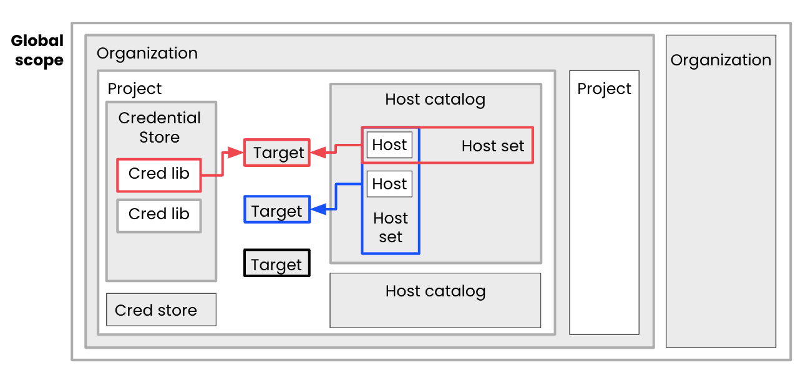
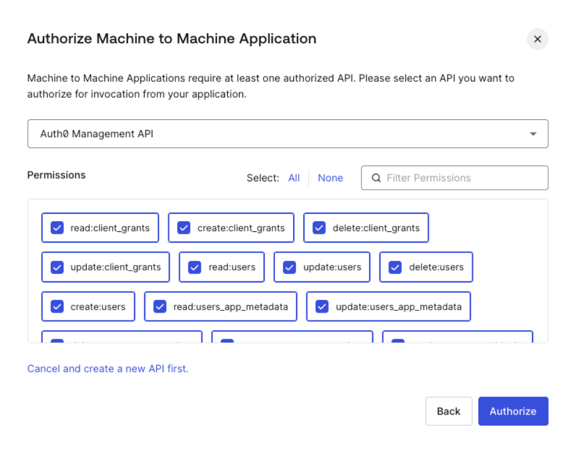
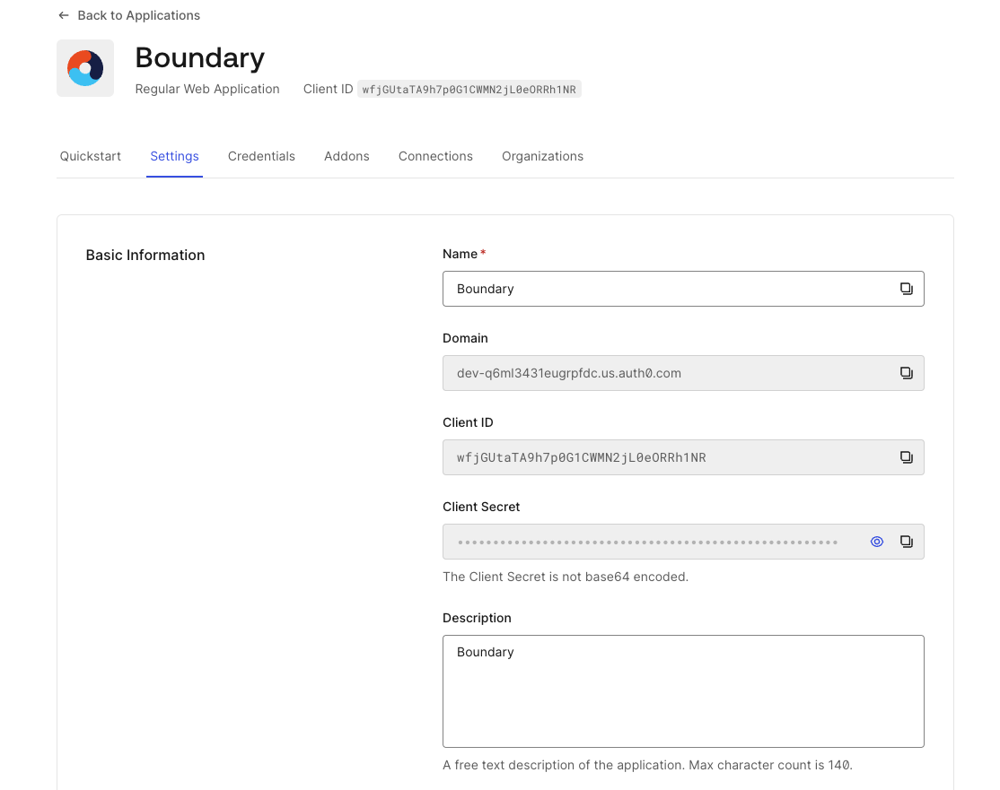

# Securing DB Access MGMT with HashiCorp Boundary

#### Prerequisites

* Terraform, Vault and Boundary CLI installed on your environment.

## 1. Building Vault and Boundary clusters in HCP and Database (RDS and DocumentDB) instances

The **Plataform** directory contains:

* The code to build a Vault and Boundary cluster in HCP together with a VPC in your AWS account.
* That VPC gets connected to HCP (where Vault is deployed) by means of a VPC peering with an HVN.
* The VPC contains a Public and Private Subnet. In the private subnet we are deploying an RDS instance with a PostgreSQL engine (the database will be configured in a second steps) and DocumentDB cluster
* After deploying the infrastructure we set a number of environmental variables that are required for the upcoming deployments.
* Finally, we authenticate with Boundary using the credentials we have defined within the `terraform.tfvars` file. Vault cluster is configured to send logs to Datadog (simply comment the stanzas to avoid this).


```bash
<export AWS Creds>
cd 1_Plataform/
# Initialize TF
terraform init
# Requires interactive login to HCP to approve cluster creation
terraform apply -auto-approve
export BOUNDARY_ADDR=$(terraform output -json | jq -r .boundary_public_url.value)
export VAULT_ADDR=$(terraform output -raw vault_public_url)
export VAULT_NAMESPACE=admin
export VAULT_TOKEN=$(terraform output -raw vault_token)
# Log to boundary interactively using password Auth with admin user
boundary authenticate
export TF_VAR_authmethod=$(boundary auth-methods list -format json | jq -r '.items[0].id')
```

> Note: This tutorial is supposed to be run in secuntial order making sure the enviromental variable installed above are used

### 1.1. Inputs

| Variable              | Type   | Example                          | Description                                      | Required                                                                                                                                                       |
| --------------------- | ------ | -------------------------------- | ------------------------------------------------ | -------------------------------------------------------------------------------------------------------------------------------------------------------------- |
| username              | String | "admin"                          | Boundary initial administrative account username | Yes                                                                                                                                                            |
| password              | String | "N0tS0Secr3tPas$w0rd"            | Boundary initial administrative account password | Yes                                                                                                                                                            |
| vault_tier            | String | "plus_small"                     | HCP Vault Tier                                   | Yes                                                                                                                                                            |
| boundary_tier         | String | "PLUS"                           | HCP Boundary Tier                                | Yes                                                                                                                                                            |
| datadog_api_key       | String | `<hex-api-key>`                | Datadog API Key                                  | Optional, remove `metrics_config` and `audit_log_config` stanzas in  `vault-deploy.tf`. Also remove variable `datadog_api_key` from `variables.tf` |
| aws_vpc_cidr          | String | "10.0.0.0/16"                    | Class A Must be used                             | Yes                                                                                                                                                            |
| vault_cluster_id      | String | "hcp-vault-cluster-for-boundary" | HCP Vault Cluster Name                           | Yes                                                                                                                                                            |
| boundary_cluster_id   | String | "hcp-boundary-cluster"           | HCP Boundary Cluster Name                        | Yes                                                                                                                                                            |
| db_username           | String | "demo"                           | Username of the master database user             | Yes                                                                                                                                                            |
| AWS_ACCESS_KEY_ID     | env    |                                  | AWS Access Key                                   | No, you can use UserID                                                                                                                                         |
| AWS_SECRET_ACCESS_KEY | env    |                                  |                                                  | No, you can use SecretID                                                                                                                                       |
| AWS_SESSION_TOKEN     | env    |                                  |                                                  | No                                                                                                                                                             |

## 2. Create Self-Managed Worker, configure RDS and Boundary/Vault

In this second step we are going to deploy an EC2 that will play two roles:

* On the one hand, it will work as Boundary Worker that will allow the connection to the Database and also to Vault itself via the private endpoint.
* On the other hand, it will serve as database configuration manager. It will create the users and roles that will be leverage by Vault's dynamic secret engine as well as create a table with mock data.

Additionally, we are going to configure Vault Dynamic Secret Engine with 4 distint roles and Boundary logic within the Project:

* Scopes (Organization and Project)
* Credential Stores (using Vault to generated JIT credentials with TTL), Credential Libraries (the Vault paths)
* Host Catalog, Host Set and Hosts (to hold our RDS instance)
* Targets (mapping the RDS with the different credentials)

Targets are a wrapper of host (host-sets) and permisions (in the form of credentials). In this demo we have a single host, but different set of `Credential Libraries` associated with different `paths` in Vault that correspond to separated roles in our database.



```bash
cd ../2_Config
terraform init
terraform apply -auto-approve
```

### 2.1. Inputs

| Variable          | Type   | Example               | Description                                                            | Required |
| ----------------- | ------ | --------------------- | ---------------------------------------------------------------------- | -------- |
| username          | String | "admin"               | Boundary initial administrative account username                       | Yes      |
| password          | String | "N0tS0Secr3tPas$w0rd" | Boundary initial administrative account password                       | Yes      |
| region            | String | "eu-west-2"           | AWS Region                                                             | Yes      |
| key_pair_name     | String | "cert"                | Name of the key pair that will be used to create the EC2 instance      | Yes      |
| authmethod        | String | "ampw_g7gkG7hioT"     | Boundary Auth Method ID. Introduced as enviromental variable in step 1 | Yes      |
| db_username       | String | "demo"                | Username of the master database user                                   | Yes      |
| BOUNDARY_ADDR     | env    |                       | Boundary URL                                                           | Yes      |
| VAULT_ADDR        | env    |                       | Vault Public URL                                                       | Yes      |
| VAULT_TOKEN       | env    |                       | Vault admin token                                                      | Yes      |
| TF_VAR_authmethod | env    |                       | auth method id                                                         | Yes      |

# 3. Mapping IdP (OIDC) Users to targets based on roles

In this step we are going to leverage Auth0 dev account to build an OIDC integration between Auth0 and Boundary. The first task will be to create an Application with access to Auth0 MGMT API:

* Go to Applications, then click on [+ Create Application] button and select "Machine to Machine Applications".
* Click on Create.
* In the next page, in the drop-down menu select "Auth0 Management API" and provide All Permissions.
* Finally click on Authorize



After its being created we can copy some of the details and pass them as enviromental variables so the Auth0 provider can consume them. Go to the setting tab and retrieve the values.



Export those values as enviromental variables and run the code

```bash
export AUTH0_DOMAIN="<domain>"
export AUTH0_CLIENT_ID="<client-id>" 
export AUTH0_CLIENT_SECRET="<client_secret>"
cd ../3_RBAC
terraform init
terraform apply -auto-approve
```

* We are setting up Boundary to use Auth0 for authentication, defining the proper callback URLs.
* We are creating 4 users that will be mapped to different roles within Boundary.

You can test it via CLI using the email address of any of the 3 users returned as Terraform output

```bash
boundary authenticate oidc -auth-method-id $(terraform output -raw auth_method_id)
boundary targets list -scope-id $(terraform output -raw project-scope-id) -format json | jq -r .
```

## 3.1. Inputs

| Variable            | Type   | Example               | Description                                                                 | Required |
| ------------------- | ------ | --------------------- | --------------------------------------------------------------------------- | -------- |
| username            | String | "admin"               | Boundary initial administrative account username                            | Yes      |
| password            | String | "N0tS0Secr3tPas$w0rd" | Boundary initial administrative account password                            | Yes      |
| auth0_password      | String | "N0tS0Secr3tPas$w0rd" | A password that will be associated to every user account we create in Auth0 |          |
| authmethod          | String | "ampw_g7gkG7hioT"     | Boundary Auth Method ID. Introduced as enviromental variable in step 1      | Yes      |
| BOUNDARY_ADDR       | env    |                       | Boundary URL                                                                | Yes      |
| TF_VAR_authmethod   | env    |                       | auth method id                                                              |          |
| AUTH0_DOMAIN        | env    |                       |                                                                             |          |
| AUTH0_CLIENT_ID     | env    |                       |                                                                             |          |
| AUTH0_CLIENT_SECRET | env    |                       |                                                                             |          |

# Workflows

## RDS DBA

```sql
> export BOUNDARY_ADDR=https://72a20d60-b9c3-438d-8664-dfcbaaaf0867.boundary.hashicorp.cloud
> boundary authenticate oidc -auth-method-id amoidc_l17XJAoZXb
Opening returned authentication URL in your browser...
https://dev-q6ml3431eugrpfdc.us.auth0.com/authorize?client_id=prJEtaNbo....

Authentication information:
  Account ID:      acctoidc_mhycKeWZdd
  Auth Method ID:  amoidc_l17XJAoZXb
  Expiration Time: Tue, 13 Feb 2024 07:48:44 CET
  User ID:         u_W4zdXRaLQB

The token name "default" was successfully stored in the chosen keyring and is not displayed here.

> boundary targets list -recursive

Target information:
  ID:                    ttcp_f6iyFgSkzK
    Scope ID:            p_MfRkfe58Bd
    Version:             3
    Type:                tcp
    Name:                RDS DBA Access
    Description:         RDS DBA Permissions
    Authorized Actions:
      authorize-session
      read

  ID:                    ttcp_1Xky8n4iI8
    Scope ID:            p_MfRkfe58Bd
    Version:             3
    Type:                tcp
    Name:                DocumentDB DBA Access
    Description:         DocumentDB: DBA Permissions
    Authorized Actions:
      read
      authorize-session
 
> boundary connect postgres -target-id ttcp_f6iyFgSkzK -dbname northwind
psql (14.10 (Homebrew), server 13.13)
SSL connection (protocol: TLSv1.2, cipher: ECDHE-RSA-AES256-GCM-SHA384, bits: 256, compression: off)
Type "help" for help.

northwind=> \conninfo
You are connected to database "northwind" as user "v-token-to-dba-wNVIPCDSDa1RNUeLajDv-1707202187" on host "127.0.0.1" at port "57865".
SSL connection (protocol: TLSv1.2, cipher: ECDHE-RSA-AES256-GCM-SHA384, bits: 256, compression: off)

northwind=> create database dbatest;
CREATE DATABASE

northwind=> \l
                                                                        List of databases
   Name    |                     Owner                      | Encoding |   Collate   |    Ctype    |                      Access privileges             
-----------+------------------------------------------------+----------+-------------+-------------+--------------------------------------------------------------
 dbatest   | v-token-to-dba-wNVIPCDSDa1RNUeLajDv-1707202187 | UTF8     | en_US.UTF-8 | en_US.UTF-8 | 
 northwind | demo                                           | UTF8     | en_US.UTF-8 | en_US.UTF-8 | demo=CTc/demo                                               +
           |                                                |          |             |             | "v-token-to-readonly-HXt20oWkIjJ20qHIfTx2-1707201737"=c/demo+
           |                                                |          |             |             | "v-token-to-dba-wNVIPCDSDa1RNUeLajDv-1707202187"=c/demo
 postgres  | demo                                           | UTF8     | en_US.UTF-8 | en_US.UTF-8 | 
 rdsadmin  | rdsadmin                                       | UTF8     | en_US.UTF-8 | en_US.UTF-8 | rdsadmin=CTc/rdsadmin                                       +
           |                                                |          |             |             | rdstopmgr=Tc/rdsadmin
 template0 | rdsadmin                                       | UTF8     | en_US.UTF-8 | en_US.UTF-8 | =c/rdsadmin                                                 +
           |                                                |          |             |             | rdsadmin=CTc/rdsadmin
 template1 | demo                                           | UTF8     | en_US.UTF-8 | en_US.UTF-8 | =c/demo                                                     +
           |                                                |          |             |             | demo=CTc/demo
(6 rows)

northwind=> CREATE ROLE bob;
CREATE ROLE
northwind=> \du
                                                                                 List of roles
                      Role name                      |                         Attributes                         |                          Member of                
-----------------------------------------------------+------------------------------------------------------------+-------------------------------------------------------------
 bob                                                 | Cannot login                                               | {}
 demo                                                | Create role, Create DB                                    +| {rds_superuser}
                                                     | Password valid until infinity                              | 
 rds_ad                                              | Cannot login                                               | {}
 rds_iam                                             | Cannot login                                               | {}
 rds_password                                        | Cannot login                                               | {}
 rds_replication                                     | Cannot login                                               | {}
 rds_superuser                                       | Cannot login                                               | {pg_monitor,pg_signal_backend,rds_replication,rds_password}
 rdsadmin                                            | Superuser, Create role, Create DB, Replication, Bypass RLS+| {}
                                                     | Password valid until infinity                              | 
 rdsrepladmin                                        | No inheritance, Cannot login, Replication                  | {}
 rdstopmgr                                           | Password valid until infinity                              | {pg_monitor}
 v-token-to-dba-wNVIPCDSDa1RNUeLajDv-1707202187      | Create role, Create DB                                    +| {rds_superuser}
                                                     | Password valid until 2024-02-06 07:49:52+00                | 
 v-token-to-readonly-HXt20oWkIjJ20qHIfTx2-1707201737 | Password valid until 2024-02-06 07:42:22+00                | {}

northwind=> CREATE TABLE "test" ("fullName" varchar(255), "isUser" varchar(255), "rating" varchar(255));
INSERT INTO "test" ("fullName", "isUser", "rating")

        VALUES ('Almeda Shields', 'true', '⭐️⭐️'), ('Daniele Upward', 'false', '⭐️⭐️');
CREATE TABLE
INSERT 0 2
northwind=> \dt
                                    List of relations
 Schema |          Name          | Type  |                     Owner            
--------+------------------------+-------+------------------------------------------------
 public | categories             | table | demo
 public | customer_customer_demo | table | demo
 public | customer_demographics  | table | demo
 public | customers              | table | demo
 public | employee_territories   | table | demo
 public | employees              | table | demo
 public | order_details          | table | demo
 public | orders                 | table | demo
 public | products               | table | demo
 public | region                 | table | demo
 public | shippers               | table | demo
 public | suppliers              | table | demo
 public | territories            | table | demo
 public | test                   | table | v-token-to-dba-wNVIPCDSDa1RNUeLajDv-1707202187
 public | us_states              | table | demo
(15 rows)

northwind=> select * from us_states;
 state_id |      state_name      | state_abbr | state_region 
----------+----------------------+------------+--------------
        1 | Alabama              | AL         | south
        2 | Alaska               | AK         | north
        3 | Arizona              | AZ         | west
        4 | Arkansas             | AR         | south
        5 | California           | CA         | west
        6 | Colorado             | CO         | west
        7 | Connecticut          | CT         | east
        8 | Delaware             | DE         | east
        9 | District of Columbia | DC         | east
       10 | Florida              | FL         | south
       11 | Georgia              | GA         | south
       12 | Hawaii               | HI         | west
       13 | Idaho                | ID         | midwest
       14 | Illinois             | IL         | midwest
       15 | Indiana              | IN         | midwest
       16 | Iowa                 | IO         | midwest
       17 | Kansas               | KS         | midwest
       18 | Kentucky             | KY         | south
       19 | Louisiana            | LA         | south
       20 | Maine                | ME         | north
       21 | Maryland             | MD         | east
       22 | Massachusetts        | MA         | north
       23 | Michigan             | MI         | north
       24 | Minnesota            | MN         | north
       25 | Mississippi          | MS         | south
       26 | Missouri             | MO         | south
       27 | Montana              | MT         | west
       28 | Nebraska             | NE         | midwest
       29 | Nevada               | NV         | west
       30 | New Hampshire        | NH         | east
       31 | New Jersey           | NJ         | east
       32 | New Mexico           | NM         | west
       33 | New York             | NY         | east
       34 | North Carolina       | NC         | east
       35 | North Dakota         | ND         | midwest
       36 | Ohio                 | OH         | midwest
       37 | Oklahoma             | OK         | midwest
       38 | Oregon               | OR         | west
       39 | Pennsylvania         | PA         | east
       40 | Rhode Island         | RI         | east
       41 | South Carolina       | SC         | east
       42 | South Dakota         | SD         | midwest
       43 | Tennessee            | TN         | midwest
       44 | Texas                | TX         | west
       45 | Utah                 | UT         | west
       46 | Vermont              | VT         | east
       47 | Virginia             | VA         | east
       48 | Washington           | WA         | west
       49 | West Virginia        | WV         | south
       50 | Wisconsin            | WI         | midwest
       51 | Wyoming              | WY         | west
(51 rows)

northwind=> select * from test;
    fullName    | isUser | rating 
----------------+--------+--------
 Almeda Shields | true   | ⭐️⭐️
 Daniele Upward | false  | ⭐️⭐️
(2 rows)
```

## RDS ReadWrite

```bash
> export BOUNDARY_ADDR=https://72a20d60-b9c3-438d-8664-dfcbaaaf0867.boundary.hashicorp.cloud

> boundary authenticate oidc -auth-method-id amoidc_l17XJAoZXb            
Opening returned authentication URL in your browser...
https://dev-q6ml3431eugrpfdc.us.auth0.com/authorize?client_id=prJEtaNbo9NqHLf7tjKeDM5GWfmI6amc&max_age=0&nonce=D4Jv2CXeWPDzOIe6ubMv&redirect_uri=https%3A%2F%2F72a20d60-b9c3-438d-8664-dfcbaaaf0867.boundary.hashicorp.cloud%2Fv1%2Fauth-methods%2Foidc%3Aauthenticate%3Acallback&response_type=co-...

Authentication information:
  Account ID:      acctoidc_tVPFQqd66p
  Auth Method ID:  amoidc_l17XJAoZXb
  Expiration Time: Tue, 13 Feb 2024 10:54:01 CET
  User ID:         u_AWdADm7539

The token name "default" was successfully stored in the chosen keyring and is not displayed here.


> boundary targets list -recursive

Target information:
  ID:                    ttcp_O4XOrZkkm2
    Scope ID:            p_MfRkfe58Bd
    Version:             3
    Type:                tcp
    Name:                DocumentDB Read/Write Access
    Description:         DocumentDB: readWriteAllDBs
    Authorized Actions:
      read
      authorize-session

  ID:                    ttcp_NJQ4NO87QJ
    Scope ID:            p_MfRkfe58Bd
    Version:             3
    Type:                tcp
    Name:                RDS Read/Write Access
    Description:         RDS: SELECT, INSERT, UPDATE, DELETE
    Authorized Actions:
      read
      authorize-session


> boundary connect postgres -target-id ttcp_NJQ4NO87QJ -dbname northwind
psql (14.10 (Homebrew), server 13.13)
SSL connection (protocol: TLSv1.2, cipher: ECDHE-RSA-AES256-GCM-SHA384, bits: 256, compression: off)
Type "help" for help.

northwind=> \conninfo
You are connected to database "northwind" as user "v-token-to-write-hcFLGfD40CeKPDpG4dSA-1707213290" on host "127.0.0.1" at port "59908".
SSL connection (protocol: TLSv1.2, cipher: ECDHE-RSA-AES256-GCM-SHA384, bits: 256, compression: off)
northwind=> create database dbatest2;
ERROR:  permission denied to create database
northwind=> \l
                                                                       List of databases
   Name    |                     Owner                      | Encoding |   Collate   |    Ctype    |                     Access privileges   
-----------+------------------------------------------------+----------+-------------+-------------+-----------------------------------------------------------
 dbatest   | v-token-to-dba-wNVIPCDSDa1RNUeLajDv-1707202187 | UTF8     | en_US.UTF-8 | en_US.UTF-8 | 
 northwind | demo                                           | UTF8     | en_US.UTF-8 | en_US.UTF-8 | demo=CTc/demo                                            +
           |                                                |          |             |             | "v-token-to-write-hcFLGfD40CeKPDpG4dSA-1707213290"=c/demo
 postgres  | demo                                           | UTF8     | en_US.UTF-8 | en_US.UTF-8 | 
 rdsadmin  | rdsadmin                                       | UTF8     | en_US.UTF-8 | en_US.UTF-8 | rdsadmin=CTc/rdsadmin                                    +
           |                                                |          |             |             | rdstopmgr=Tc/rdsadmin
 template0 | rdsadmin                                       | UTF8     | en_US.UTF-8 | en_US.UTF-8 | =c/rdsadmin                                              +
           |                                                |          |             |             | rdsadmin=CTc/rdsadmin
 template1 | demo                                           | UTF8     | en_US.UTF-8 | en_US.UTF-8 | =c/demo                                                  +
           |                                                |          |             |             | demo=CTc/demo
(6 rows)

northwind=> CREATE TABLE "test2" ("fullName" varchar(255), "isUser" varchar(255), "rating" varchar(255));
ERROR:  permission denied for schema public
LINE 1: CREATE TABLE "test2" ("fullName" varchar(255), "isUser" varc...
                     ^
northwind=> INSERT INTO "test" ("fullName", "isUser", "rating") VALUES ('Katie Kildea', 'false', '⭐️⭐️'), ('Micah Bonass', 'true', '⭐️⭐️⭐️⭐️'), ('Brigid Whitsey', 'true', '⭐️⭐️');
INSERT 0 3
northwind=> select * from us_states;
 state_id |      state_name      | state_abbr | state_region 
----------+----------------------+------------+--------------
        1 | Alabama              | AL         | south
        2 | Alaska               | AK         | north
        3 | Arizona              | AZ         | west
        4 | Arkansas             | AR         | south
        5 | California           | CA         | west
        6 | Colorado             | CO         | west
        7 | Connecticut          | CT         | east
        8 | Delaware             | DE         | east
        9 | District of Columbia | DC         | east
       10 | Florida              | FL         | south
       11 | Georgia              | GA         | south
       12 | Hawaii               | HI         | west
       13 | Idaho                | ID         | midwest
       14 | Illinois             | IL         | midwest
       15 | Indiana              | IN         | midwest
       16 | Iowa                 | IO         | midwest
       17 | Kansas               | KS         | midwest
       18 | Kentucky             | KY         | south
       19 | Louisiana            | LA         | south
       20 | Maine                | ME         | north
       21 | Maryland             | MD         | east
       22 | Massachusetts        | MA         | north
       23 | Michigan             | MI         | north
       24 | Minnesota            | MN         | north
       25 | Mississippi          | MS         | south
       26 | Missouri             | MO         | south
       27 | Montana              | MT         | west
       28 | Nebraska             | NE         | midwest
       29 | Nevada               | NV         | west
       30 | New Hampshire        | NH         | east
       31 | New Jersey           | NJ         | east
       32 | New Mexico           | NM         | west
       33 | New York             | NY         | east
       34 | North Carolina       | NC         | east
       35 | North Dakota         | ND         | midwest
       36 | Ohio                 | OH         | midwest
       37 | Oklahoma             | OK         | midwest
       38 | Oregon               | OR         | west
       39 | Pennsylvania         | PA         | east
       40 | Rhode Island         | RI         | east
       41 | South Carolina       | SC         | east
       42 | South Dakota         | SD         | midwest
       43 | Tennessee            | TN         | midwest
       44 | Texas                | TX         | west
       45 | Utah                 | UT         | west
       46 | Vermont              | VT         | east
       47 | Virginia             | VA         | east
       48 | Washington           | WA         | west
       49 | West Virginia        | WV         | south
       50 | Wisconsin            | WI         | midwest
       51 | Wyoming              | WY         | west
(51 rows)

northwind=> select * from test;
    fullName    | isUser | rating 
----------------+--------+--------
 Almeda Shields | true   | ⭐️⭐️
 Daniele Upward | false  | ⭐️⭐️
 Katie Kildea   | false  | ⭐️⭐️
 Micah Bonass   | true   | ⭐️⭐️⭐️⭐️
 Brigid Whitsey | true   | ⭐️⭐️
(5 rows)
```

## RDS ReadOnly

```bash
> export BOUNDARY_ADDR=https://72a20d60-b9c3-438d-8664-dfcbaaaf0867.boundary.hashicorp.cloud

> boundary authenticate oidc -auth-method-id amoidc_l17XJAoZXb
Opening returned authentication URL in your browser...
https://dev-q6ml3431eugrpfdc.us.auth0.com/authorize?client_id=prJEtaNbo9NqHLf7tjKeDM5GWfmI6amc&max_age=0&nonce=gTGh7INtRzT0G2hPN1WY&redirect_uri=https%3A%...

Authentication information:
  Account ID:      acctoidc_pAmhCujkNE
  Auth Method ID:  amoidc_l17XJAoZXb
  Expiration Time: Tue, 13 Feb 2024 11:11:07 CET
  User ID:         u_h3xO0X79Og

The token name "default" was successfully stored in the chosen keyring and is not displayed here.

> boundary targets list -recursive

Target information:
  ID:                    ttcp_NyckluxxQp
    Scope ID:            p_MfRkfe58Bd
    Version:             3
    Type:                tcp
    Name:                RDS ReadOnly Access
    Description:         RDS: SELECT
    Authorized Actions:
      read
      authorize-session

  ID:                    ttcp_18raqgMmbq
    Scope ID:            p_MfRkfe58Bd
    Version:             3
    Type:                tcp
    Name:                DocumentDB ReadOnly Access
    Description:         DocumentDB: readAllDBs
    Authorized Actions:
      authorize-session
      read

> boundary connect postgres -target-id ttcp_NyckluxxQp -dbname northwind   
psql (14.10 (Homebrew), server 13.13)
SSL connection (protocol: TLSv1.2, cipher: ECDHE-RSA-AES256-GCM-SHA384, bits: 256, compression: off)
Type "help" for help.

northwind=> \conninfo
You are connected to database "northwind" as user "v-token-to-readonly-pLqGwK7sOeRJIl35s0JG-1707214382" on host "127.0.0.1" at port "60227".
SSL connection (protocol: TLSv1.2, cipher: ECDHE-RSA-AES256-GCM-SHA384, bits: 256, compression: off)
northwind=> CREATE TABLE "test3" ("fullName" varchar(255), "isUser" varchar(255), "rating" varchar(255));
ERROR:  permission denied for schema public
LINE 1: CREATE TABLE "test3" ("fullName" varchar(255), "isUser" varc...
                     ^
northwind=> INSERT INTO "test" ("fullName", "isUser", "rating") VALUES ('Katie Kildea', 'false', '⭐️⭐️'), ('Micah Bonass', 'true', '⭐️⭐️⭐️⭐️'), ('Brigid Whitsey', 'true', '⭐️⭐️');
ERROR:  permission denied for table test
northwind=> select * from us_states;
 state_id |      state_name      | state_abbr | state_region 
----------+----------------------+------------+--------------
        1 | Alabama              | AL         | south
        2 | Alaska               | AK         | north
        3 | Arizona              | AZ         | west
        4 | Arkansas             | AR         | south
        5 | California           | CA         | west
        6 | Colorado             | CO         | west
        7 | Connecticut          | CT         | east
        8 | Delaware             | DE         | east
        9 | District of Columbia | DC         | east
       10 | Florida              | FL         | south
       11 | Georgia              | GA         | south
       12 | Hawaii               | HI         | west
       13 | Idaho                | ID         | midwest
       14 | Illinois             | IL         | midwest
       15 | Indiana              | IN         | midwest
       16 | Iowa                 | IO         | midwest
       17 | Kansas               | KS         | midwest
       18 | Kentucky             | KY         | south
       19 | Louisiana            | LA         | south
       20 | Maine                | ME         | north
       21 | Maryland             | MD         | east
       22 | Massachusetts        | MA         | north
       23 | Michigan             | MI         | north
       24 | Minnesota            | MN         | north
       25 | Mississippi          | MS         | south
       26 | Missouri             | MO         | south
       27 | Montana              | MT         | west
       28 | Nebraska             | NE         | midwest
       29 | Nevada               | NV         | west
       30 | New Hampshire        | NH         | east
       31 | New Jersey           | NJ         | east
       32 | New Mexico           | NM         | west
       33 | New York             | NY         | east
       34 | North Carolina       | NC         | east
       35 | North Dakota         | ND         | midwest
       36 | Ohio                 | OH         | midwest
       37 | Oklahoma             | OK         | midwest
       38 | Oregon               | OR         | west
       39 | Pennsylvania         | PA         | east
       40 | Rhode Island         | RI         | east
       41 | South Carolina       | SC         | east
       42 | South Dakota         | SD         | midwest
       43 | Tennessee            | TN         | midwest
       44 | Texas                | TX         | west
       45 | Utah                 | UT         | west
       46 | Vermont              | VT         | east
       47 | Virginia             | VA         | east
       48 | Washington           | WA         | west
       49 | West Virginia        | WV         | south
       50 | Wisconsin            | WI         | midwest
       51 | Wyoming              | WY         | west
(51 rows)


northwind=> select * from test;
    fullName    | isUser | rating 
----------------+--------+--------
 Almeda Shields | true   | ⭐️⭐️
 Daniele Upward | false  | ⭐️⭐️
 Katie Kildea   | false  | ⭐️⭐️
 Micah Bonass   | true   | ⭐️⭐️⭐️⭐️
 Brigid Whitsey | true   | ⭐️⭐️
(5 rows)
```

# DocumentDB DBA

```sql_more
> mongosh --tls --host 127.0.0.1:50387 --username v-token-token-dba-9NB04Eptj9j8J2z2UeJZ-1707244196 --password C209h3O-YeL-CwHQYvaY --tlsAllowInvalidCertificates --retryWrites false
Current Mongosh Log ID: 65c27c8d14fec5f6b5dedcfc
Connecting to:          mongodb://<credentials>@127.0.0.1:50387/?directConnection=true&serverSelectionTimeoutMS=2000&tls=true&tlsAllowInvalidCertificates=true&retryWrites=false&appName=mongosh+2.1.3
Using MongoDB:          5.0.0
Using Mongosh:          2.1.3

For mongosh info see: https://docs.mongodb.com/mongodb-shell/
rs0 [direct: primary] test> db.runCommand({connectionStatus : 1})
{
  authInfo: {
    authenticatedUsers: [
      {
        user: 'v-token-token-dba-9NB04Eptj9j8J2z2UeJZ-1707244196',
        db: 'admin'
      }
    ],
    authenticatedUserRoles: [
      { role: 'dbAdminAnyDatabase', db: 'admin' },
      { role: 'readWriteAnyDatabase', db: 'admin' },
      { role: 'userAdminAnyDatabase', db: 'admin' }
    ]
  },
  ok: 1,
  operationTime: Timestamp({ t: 1707244136, i: 1 })
}

rs0 [direct: primary] testdb> use mydatabase
switched to db mydatabase
rs0 [direct: primary] mydatabase> 

rs0 [direct: primary] mydatabase> db.createCollection("mycollection")
{ ok: 1 }
rs0 [direct: primary] mydatabase> db.mycollection.insertOne({
   name: 'John Doe',
   age: 30,
   city: 'New York'
})
{
  acknowledged: true,
  insertedId: ObjectId('65c27da614fec5f6b5dedcff')
}
rs0 [direct: primary] mydatabase> db.mycollection.find()
[
  {
    _id: ObjectId('65c27da614fec5f6b5dedcff'),
    name: 'John Doe',
    age: 30,
    city: 'New York'
  }
]
rs0 [direct: primary] mydatabase> db.mycollection.drop()
true
rs0 [direct: primary] mydatabase> db.dropDatabase()
{ ok: 1, dropped: 'mydatabase' }
rs0 [direct: primary] mydatabase> use test
switched to db test
rs0 [direct: primary] test> db.getUsers()
{
  ok: 1,
  users: [
    {
      _id: 'serviceadmin',
      user: 'serviceadmin',
      db: 'admin',
      roles: [ { db: 'admin', role: 'root' } ]
    },
    {
      _id: 'demo',
      user: 'demo',
      db: 'admin',
      roles: [ { db: 'admin', role: 'root' } ]
    },
    {
      _id: 'v-token-token-dba-9NB04Eptj9j8J2z2UeJZ-1707244196',
      user: 'v-token-token-dba-9NB04Eptj9j8J2z2UeJZ-1707244196',
      db: 'admin',
      roles: [
        { db: 'admin', role: 'userAdminAnyDatabase' },
        { db: 'admin', role: 'dbAdminAnyDatabase' },
        { db: 'admin', role: 'readWriteAnyDatabase' }
      ]
    }
  ],
  operationTime: Timestamp({ t: 1707245099, i: 1 })
}
```

# DocumentDB ReadWrite

```sql_more
> mongosh --tls --host 127.0.0.1:52066 --username v-token-token-read_write-7fvTfU6B4kUh9acVkilx-1707287236 --password WsQjYJz0AJxql-VSQoX1 --tlsAllowInvalidCertificates --retryWrites false
Current Mongosh Log ID:	65c322fe6f5259b2e84bf428
Connecting to:		mongodb://<credentials>@127.0.0.1:52066/?directConnection=true&serverSelectionTimeoutMS=2000&tls=true&tlsAllowInvalidCertificates=true&retryWrites=false&appName=mongosh+2.1.3
Using MongoDB:		5.0.0
Using Mongosh:		2.1.3

For mongosh info see: https://docs.mongodb.com/mongodb-shell/


rs0 [direct: primary] test> db.runCommand({connectionStatus : 1})
{
  authInfo: {
    authenticatedUsers: [
      {
        user: 'v-token-token-read_write-7fvTfU6B4kUh9acVkilx-1707287236',
        db: 'admin'
      }
    ],
    authenticatedUserRoles: [ { role: 'readWriteAnyDatabase', db: 'admin' } ]
  },
  ok: 1,
  operationTime: Timestamp({ t: 1707287426, i: 1 })
}
rs0 [direct: primary] test> use mydatabase2
switched to db mydatabase2
rs0 [direct: primary] mydatabase2> db.createCollection("mycollection2")
{ ok: 1 }
rs0 [direct: primary] mydatabase2> db.mycollection2.insertOne({
    name: 'John Doe',
    age: 30,
    city: 'New York'
})
{
  acknowledged: true,
  insertedId: ObjectId('65c323da6f5259b2e84bf429')
}
rs0 [direct: primary] mydatabase2> db.mycollection.find()
[
  {
    _id: ObjectId('65c323da6f5259b2e84bf429'),
    name: 'John Doe',
    age: 30,
    city: 'New York'
  }
]
rs0 [direct: primary] mydatabase2> db.mycollection.drop()
true
rs0 [direct: primary] mydatabase2> db.dropDatabase()
MongoServerError: Authorization failure
rs0 [direct: primary] mydatabase2> use test
switched to db test
rs0 [direct: primary] test> db.getUsers()
MongoServerError: Authorization failure
```

# DocumentDB ReadOnly

```sql_more
> mongosh --tls --host 127.0.0.1:52339 --username v-token-token-read_only-Tpyaf33LpBFFHesRysey-1707287972 --password K2wzFu4Wpn03-eRyhRkh --tlsAllowInvalidCertificates --retryWrites false
Current Mongosh Log ID:	65c325f2738759ec391a160b
Connecting to:		mongodb://<credentials>@127.0.0.1:52339/?directConnection=true&serverSelectionTimeoutMS=2000&tls=true&tlsAllowInvalidCertificates=true&retryWrites=false&appName=mongosh+2.1.3
Using MongoDB:		5.0.0
Using Mongosh:		2.1.3


rs0 [direct: primary] test> db.runCommand({connectionStatus : 1})
{
  authInfo: {
    authenticatedUsers: [
      {
        user: 'v-token-token-read_only-Tpyaf33LpBFFHesRysey-1707287972',
        db: 'admin'
      }
    ],
    authenticatedUserRoles: [ { role: 'readAnyDatabase', db: 'admin' } ]
  },
  ok: 1,
  operationTime: Timestamp({ t: 1707288068, i: 1 })
}
rs0 [direct: primary] test> use mydatabase3
switched to db mydatabase3
rs0 [direct: primary] mydatabase3> db.createCollection("mycollection3")
MongoServerError: Authorization failure
rs0 [direct: primary] mydatabase3> use mydatabase2
switched to db mydatabase2
rs0 [direct: primary] mydatabase2> db.mycollection.insertOne({
...     name: 'John Doe',
...     age: 30,
...     city: 'New York'
... })
MongoServerError: Authorization failure

rs0 [direct: primary] mydatabase2> db.runCommand(
...    {
...        listCollections: 1.0,
...        authorizedCollections: true,
...        nameOnly: true
...    }
... )
{
  waitedMS: Long('0'),
  cursor: {
    firstBatch: [ { name: 'mycollection2', type: 'collection' } ],
    id: Long('0'),
    ns: 'mydatabase2.$cmd.listCollections'
  },
  ok: 1,
  operationTime: Timestamp({ t: 1707288297, i: 1 })
}

rs0 [direct: primary] mydatabase2> db.mycollection2.find()
[
  {
    _id: ObjectId('65c327e8feed21cc028b8bd7'),
    name: 'John Doe',
    age: 30,
    city: 'New York'
  }
]
rs0 [direct: primary] mydatabase2> db.mycollection2.drop()
MongoServerError: Authorization failure
rs0 [direct: primary] mydatabase2> db.dropDatabase()
MongoServerError: Authorization failure
rs0 [direct: primary] mydatabase2> db.getUsers()
MongoServerError: Authorization failure
rs0 [direct: primary] mydatabase2> exit
```

# Clean UP

```bash
terraform destroy -auto-approve
cd ../2_Config/
vault lease revoke -force -prefix database && terraform destroy -auto-approve && rm -rf cert.pem
cd ../1_Platform
terraform destroy -auto-approve
```
